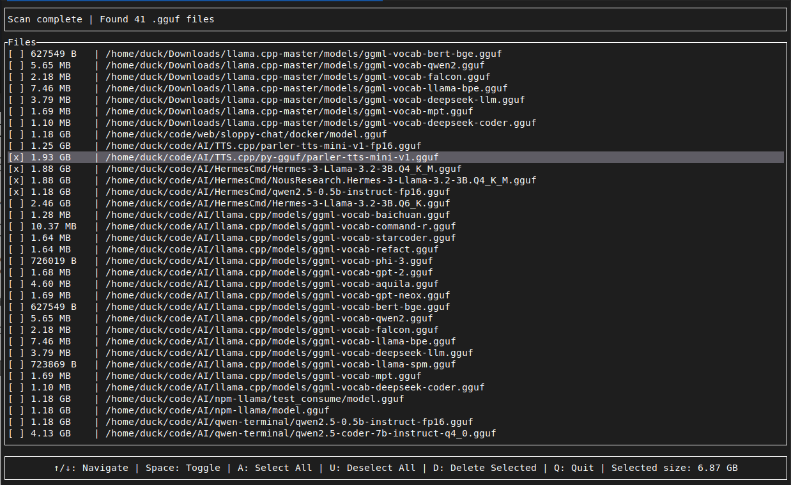

# GGUFScan

[](https://github.com/duck4i/ggufscan/actions/workflows/rust.yml)

A simple TUI tool for finding and removing the .gguf files to save the disk storage. Fast.



## Magic bytes, Ollama and other tools

```
const GGUF_MAGIC: &[u8] = b"GGUF";
```

Instead of simply checking the `.gguf` extension the tool scans the files for the GGUF magic bytes, and will discover downloaded models from various tools, including the Ollama download caches.
